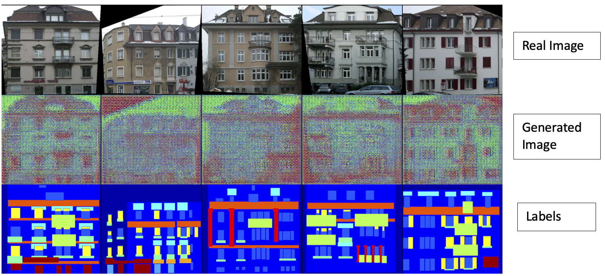
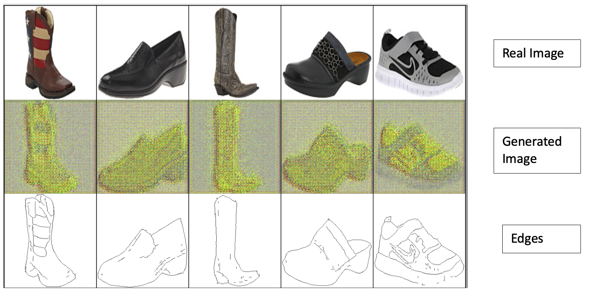
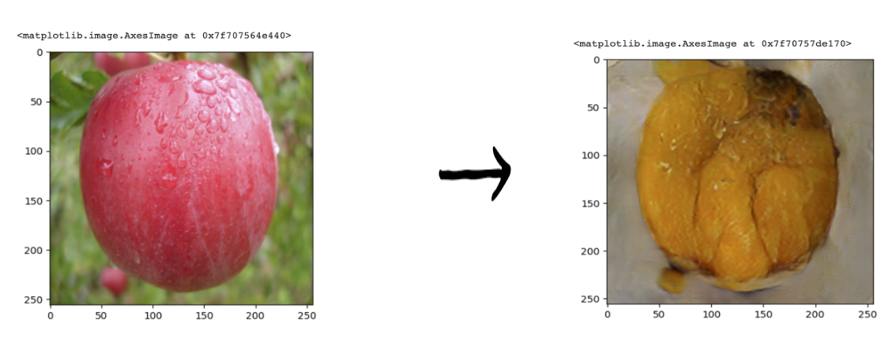
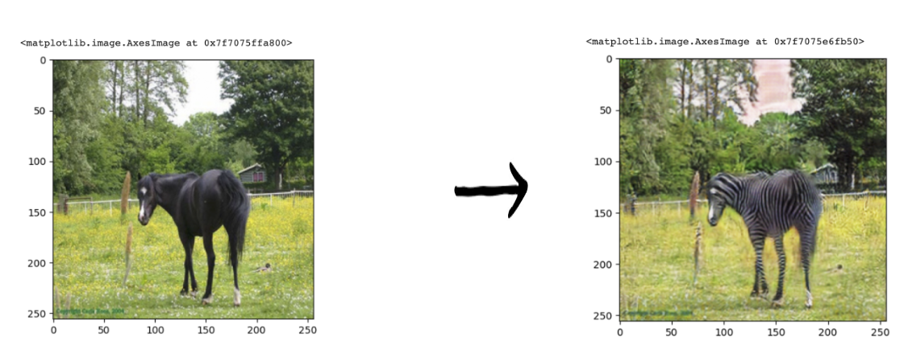

# Image-to-Image-Translation

## Overview
This project explores four advanced GAN architectures - CycleGAN, Pix2Pix-GAN, Wasserstein GAN, and Deep Convolutional GAN - for image-to-image translation. It extends to text-driven image translation, leveraging these GANs to transform textual descriptions into images.

## Repo Structure
```
Image-to-Image-Translation-GANs
├── models
│ ├── CycleGAN_implementation.py
│ ├── Pix2Pix_GAN_implementation.py
│ ├── Wasserstein_GAN_implementation.py
│ ├── Deep_Convolutional_GAN_implementation.py
└── Project_Report.pdf
```

## How to Run
- Install required libraries: TensorFlow, Keras, etc.
- Run each model's Python file for respective GAN implementations.
- Refer to `Project_Report.pdf` for detailed methodology and analysis.

## Results Overview
The project demonstrates each GAN's effectiveness in various image translation tasks. Final outputs and comparative analyses are detailed in the project report.





